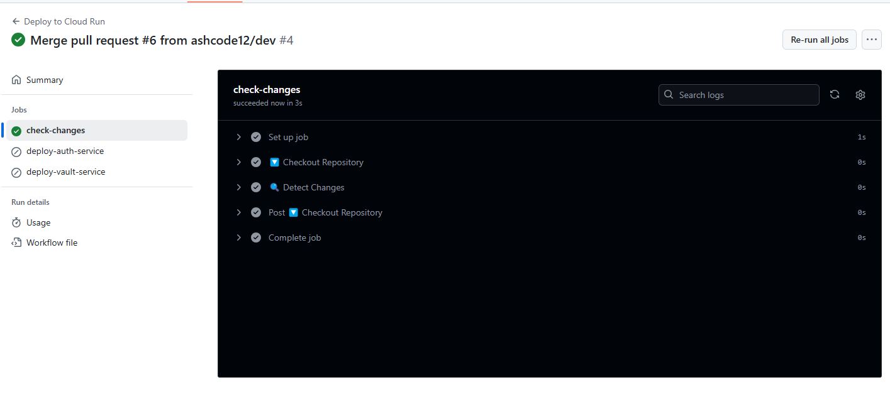

## **🔍 Overview**
The previous deployment strategy **redeployed all microservices** whenever changes were pushed to the `main` branch. This approach was inefficient as it:
- Wasted cloud resources by redeploying unchanged services.
- Increased deployment time unnecessarily.
- Added risk to stable microservices due to frequent deployments.

To optimize our Continuous Deployment (CD) process, we implemented **Selective Microservice Deployment** using GitHub Actions.

---

## **🎯 Goal**
✅ **Ensure only changed microservices are built & deployed.**  
✅ **Reduce deployment time & cloud costs.**  
✅ **Improve scalability for future microservices.**

---

## **🛠 Changes Implemented**
### **1️⃣ Detect Changes Before Deployment**
We used the [`dorny/paths-filter`](https://github.com/dorny/paths-filter) GitHub Action to check which microservices were modified before running the build and deploy steps.

```yaml
  check-changes:
    runs-on: ubuntu-latest
    outputs:
      auth-service: ${{ steps.filter.outputs.auth-service }}
      vault-service: ${{ steps.filter.outputs.vault-service }}
    steps:
      - name: 🔽 Checkout Repository
        uses: actions/checkout@v3

      - name: 🔍 Detect Changes
        id: filter
        uses: dorny/paths-filter@v2
        with:
          filters: |
            auth-service:
              - 'auth-service/**'
            vault-service:
              - 'vault-service/**'
```
- If **no changes** are detected for a microservice, **it will not be built or deployed**.
- If **changes exist**, GitHub Actions **runs the corresponding deployment job**.

---

### **2️⃣ Independent Deployment Jobs**
Each microservice (`auth-service` and `vault-service`) **has its own job**, which only runs if changes are detected.

✅ **Build & deploy `auth-service` only if changes were made:**
```yaml
  deploy-auth-service:
    needs: check-changes
    if: needs.check-changes.outputs.auth-service == 'true'
    runs-on: ubuntu-latest
    steps:
      - name: 🔽 Checkout Repository
        uses: actions/checkout@v3

      - name: 🔐 Authenticate with Google Cloud
        uses: google-github-actions/auth@v1
        with:
          credentials_json: ${{ secrets.GCP_SA_KEY }}

      - name: ⛅ Set up Google Cloud SDK
        uses: google-github-actions/setup-gcloud@v1

      - name: 🔄 Configure Docker for Google Artifact Registry
        run: gcloud auth configure-docker europe-west1-docker.pkg.dev

      - name: 🏗 Build & Push Auth-Service
        run: |
          docker build -t europe-west1-docker.pkg.dev/pmdevops/auth-service/auth-service:latest ./auth-service
          docker push europe-west1-docker.pkg.dev/pmdevops/auth-service/auth-service:latest

      - name: 🚀 Deploy Auth-Service to Cloud Run
        run: |
          gcloud run deploy auth-service \
            --image europe-west1-docker.pkg.dev/pmdevops/auth-service/auth-service:latest \
            --region europe-west1 \
            --allow-unauthenticated
```
✅ **Same process for `vault-service`:**
```yaml
  deploy-vault-service:
    needs: check-changes
    if: needs.check-changes.outputs.vault-service == 'true'
    runs-on: ubuntu-latest
    steps:
      - name: 🔽 Checkout Repository
        uses: actions/checkout@v3

      - name: 🔐 Authenticate with Google Cloud
        uses: google-github-actions/auth@v1
        with:
          credentials_json: ${{ secrets.GCP_SA_KEY }}

      - name: ⛅ Set up Google Cloud SDK
        uses: google-github-actions/setup-gcloud@v1

      - name: 🔄 Configure Docker for Google Artifact Registry
        run: gcloud auth configure-docker europe-west1-docker.pkg.dev

      - name: 🏗 Build & Push Vault-Service
        run: |
          docker build -t europe-west1-docker.pkg.dev/pmdevops/vault-service/vault-service:latest ./vault-service
          docker push europe-west1-docker.pkg.dev/pmdevops/vault-service/vault-service:latest

      - name: 🚀 Deploy Vault-Service to Cloud Run
        run: |
          gcloud run deploy vault-service \
            --image europe-west1-docker.pkg.dev/pmdevops/vault-service/vault-service:latest \
            --region europe-west1 \
            --allow-unauthenticated
```

---

## **⚡ Benefits of This Approach**
| 🔍 **Feature**          | ✅ **Improvement** |
|------------------------|-------------------|
| **Selective Deployment** | Only updates the microservices that changed. |
| **Faster CI/CD**        | No need to build & push unnecessary images. |
| **Cost-Effective**      | Saves Google Cloud costs by reducing deployments. |
| **Easier Debugging**    | Fewer changes deployed = Easier rollback. |
| **Future-Proof**        | Can add more microservices with minimal effort. |

---

## **🚀 Next Steps**
1️⃣ **Push this updated `deploy.yml` & documentation to `main`.**  
2️⃣ **Verify that only modified services are deployed.**  
3️⃣ **Develop the new "Password Strength Microservice"** 🔐  

---

### **📌 Summary**
We implemented **Selective Microservice Deployment** to **reduce cloud costs, speed up CI/CD, and make future updates easier**. This ensures that **only the microservices that changed are built and deployed**.

**🔹 Now, we can move on to improving security & adding new microservices efficiently.**

---
